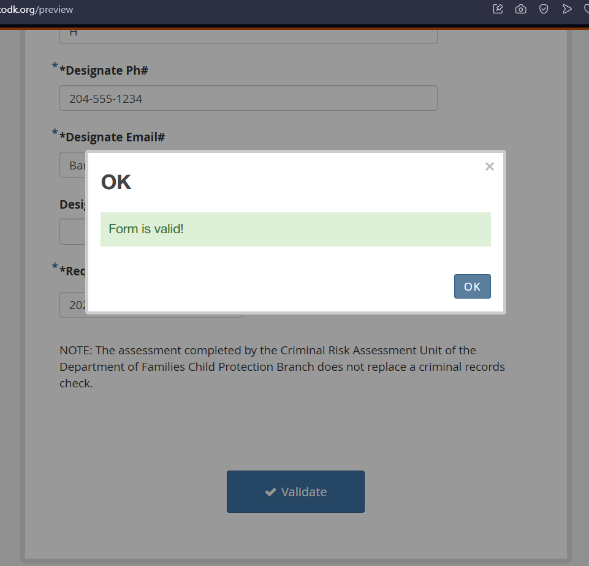

# Criminal Risk Assessment Request — ODK XLSForm

An ODK XLSForm implementation of the Manitoba Families "Criminal Risk Assessment Request" form, built for Diona Technologies' Assignment 2.

## Overview

The source material is a paper form used by Manitoba Families' Criminal Risk Assessment Unit (CRAU) to request a criminal risk check. This project converts the PDF into a robust, digital XLSForm that preserves the original's fields, required-field markings, and implements operational rules and constraints directly into the form logic.

## Objective

The assignment required developing an ODK XLSForm based on the attached PDF, ensuring the form matched the requirements and structure specified in the document. Concretely, this involved:

* Mapping every field from the source PDF to an appropriate XLSForm question type.
* Implementing the conditional logic, required fields, and validation rules specified in the PDF text (e.g., minimum two-piece identification, future-date prevention).
* Documenting the process, design decisions, and providing a comprehensive video walkthrough.
* Ensuring the form compiles cleanly and can be validated end-to-end using ODK XLSForm tools.

## Tools Used

| Tool | Purpose |
| ---- | ------- |
| **Microsoft Excel** | Authoring the main XLSForm (`survey`, `choices`, `settings` sheets) |
| **ODK XLSForm Online** | Interactive preview, validation, and manual testing |
| **FreeImage** | Hosting image resources for testing external media rendering |
| **Git / GitHub** | Version control and submission hosting |
| **Loom** | Recording the comprehensive assignment demonstration video |

## Repository Structure

```text
Diona_Assessment2/
├── README.md
├── Criminal Risk Assessment Request.pdf                  # Source PDF
├── Criminal_Risk_Assessment_Request_XLSForm.xlsx         # Main XLSForm
├── xforms/                                               # Compiled XForm XML files
│   ├── Criminal_Risk_Assessment_Request_XLSForm.xml
│   └── Criminal_Risk_Assessment_Request_XLSForm_PREVIEW_ONLY.xml
├── media/                                                # Image resources (logos, references)
│   ├── logo.png
│   └── drivers_license_reference.jpg
├── validation/                                           # Validation evidence
│   └── xlsform-validation.png
├── docs/                                                 # Documentation and development notes
│   ├── 01-approach-and-planning.md
│   ├── 02-pdf-to-xlsform-mapping.md
│   ├── 03-validation-and-testing.md
│   ├── 04-image-rendering-issue.md
│   └── notebook/                                         # Handwritten planning notes
│       ├── page-01.jpeg
│       ├── page-02.jpeg
│       ├── page-03.jpeg
│       └── page-04.jpeg
└── video/
    └── assignment-demonstration.md                       # Link to the demonstration video
```

## Testing and Validation

1. Open [ODK XLSForm Online](https://getodk.org/xlsform/)
2. Upload `Criminal_Risk_Assessment_Request_XLSForm.xlsx`
3. Select **Preview in browser** to interactively test the form and verify logic.

The form compiles to a valid ODK XForm without errors. Evidence of this validation can be found in `validation/xlsform-validation.png`.



## XLSForm Components

An XLSForm is authored as a spreadsheet with specific sheets dictating form behavior. This implementation utilizes all three core sheets:

| Sheet | Role | Implementation Details |
| ----- | ---- | ---------------------- |
| **survey** | Defines the form questions, logic, and flow. | Contains all fields from the PDF, including `relevant`, `required`, `constraint`, and `calculation` columns for conditional logic. Grouped into sections to match the PDF structure. |
| **choices** | Holds option lists for select questions. | Lists for sex, identification types, and other multiple-choice options. |
| **settings** | Form-level configuration. | Contains `form_title`, `form_id`, and other metadata for deployment. |

## Design Decisions and Logic

The PDF outlines several operational rules that go beyond a simple 1:1 field transcription. These were implemented directly into the form's logic:

| Rule in the source PDF | How it is enforced in the XLSForm |
| ---------------------- | --------------------------------- |
| **"Two pieces of identification" required** | A constraint on the `select_multiple` ID question requires at least two selections before submission is allowed. |
| **Conditional ID fields** | Fields like "Other ID detail" or "Driver's license number" only appear if their corresponding checkbox is selected, keeping the form uncluttered. |
| **Required fields (Asterisk convention)** | Required fields strictly follow the PDF's asterisk convention. Unmarked fields are optional, preventing artificial blockages. |
| **Consent & Signatures** | Signature capture, witness fields, and "Unconsented" logic determine the flow of the consent process. |
| **Future-date prevention** | Constraints prevent users from entering future dates for birth dates, consent dates, and last assessment dates. |
| **Subject Name consistency** | The person's name is tied to the initial Personal Information block using calculated/read-only fields, preventing mismatches later in the form. |

## Assumptions

* Fields critical to identity or contact (e.g., phone numbers, emails) were treated with strict formatting rules to ensure high data quality.
* "Signature of person being assessed" and "Witness" were implemented as dedicated signature-capture fields rather than plain text inputs.
* The structure is organized into logical groups (Consent, Personal Info, Identification, Agency Request) with field-list appearances to improve user experience on mobile devices.

## Documentation

Extensive documentation of the development process is located in the `docs/` folder:
* **01-approach-and-planning.md**: Initial planning and methodology.
* **02-pdf-to-xlsform-mapping.md**: Field-by-field mapping strategy.
* **03-validation-and-testing.md**: Testing procedures and logic verification.
* **04-image-rendering-issue.md**: Troubleshooting notes for external media.
* **notebook/**: Photographs of handwritten planning and reasoning.

## Video Demonstration

A link to the comprehensive assignment demonstration video, along with a note regarding its length, is available here:
[video/assignment-demonstration.md](video/assignment-demonstration.md)
